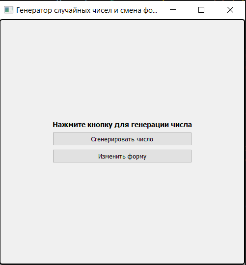
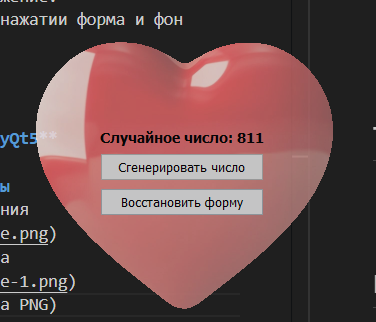
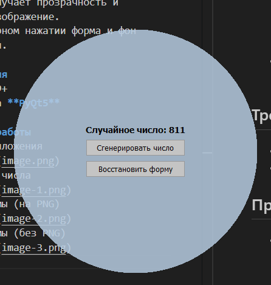

# Лабораторная работа №1: Генератор случайных чисел и смена формы окна

Простое приложение на **PyQt5**, которое демонстрирует:
- Генерацию случайного числа по нажатию кнопки
- Изменение формы окна
- Установку прозрачности и фона для окна

## Функционал
- **Кнопка "Сгенерировать число"** — отображает случайное число от 1 до 1000.
- **Кнопка "Изменить форму"** — изменяет форму окна:
  - Если найден PNG-файл `lab1/shiny-red-heart-symbol-love-affection.png`, используется его маска.
  - Если файл отсутствует или не загружается, создаётся круглая форма программно.
  - Окно получает прозрачность и фоновое изображение.
- При повторном нажатии форма и фон сбрасываются.

## Требования
- Python 3.9+
- Библиотека **PyQt5**

## Примеры работы
- Запуск приложения

- Генерация числа

- Смена формы (на PNG)

- Смена формы (без PNG)

