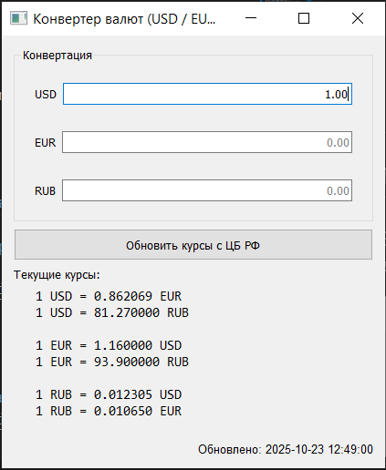
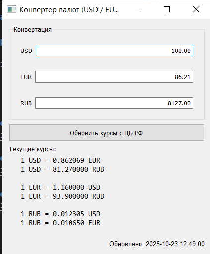
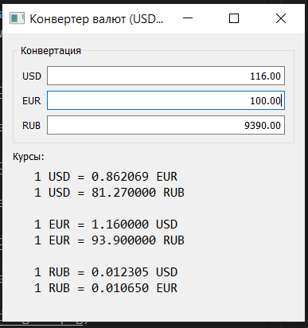
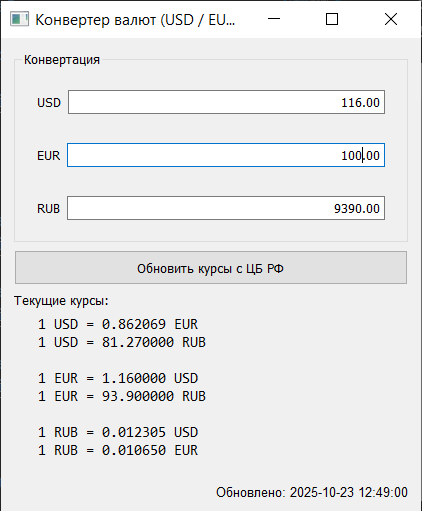

# Конвертер валют
Приложение на **PyQt5** с возможностями:

* Конвертация между тремя валютами: **USD / EUR / RUB**
* Обновление двух остальных полей при вводе значения в любое поле
* Отображение текущих курсов «каждый к каждому» в окне

---

## Функционал

* Три поля ввода:

  * **USD** — доллары
  * **EUR** — евро
  * **RUB** — рубли
* При вводе числа в любое поле два других автоматически показывают преобразованные значения по заданным в программе курсам
* Пустой ввод очищает остальные поля
* Информационный лейбл выводит курсы

---

## Требования

* Python 3.9+
* PyQt5

## Примеры работы
- Запуск приложения (по умолчанию 1 доллар)

- Изменение значения доллара
  

- Изменение значения евро
  

- Изменение значения рубля
  
