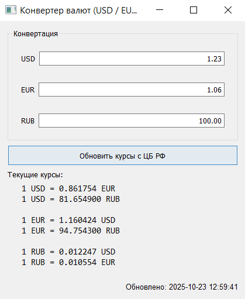

# Конвертер валют
Приложение на **PyQt5** с возможностями:

* Конвертация между тремя валютами: USD / EUR / RUB
* Обновление двух остальных полей при вводе значения в любое поле
* Отображение текущих курсов «каждый к каждому» в окне
* Автоматическое получение актуальных курсов с сайта ЦБ РФ
* Модульная архитектура с разделением по классам валют
* Сигнальная система PyQt5 для связи между компонентами
* Кэширование курсов для офлайн-работы

---

## Функционал

* Три поля ввода:

  * **USD** — доллары
  * **EUR** — евро
  * **RUB** — рубли

* При вводе числа в любое поле два других автоматически показывают преобразованные значения по текущим курсам
* Пустой ввод очищает остальные поля
* Информационный лейбл выводит курсы обмена между всеми валютами
* Кнопка **"Обновить курсы с ЦБ РФ"** для получения актуальных курсов
* Отображение времени последнего обновления курсов
* Автоматическое сохранение и загрузка курсов между сессиями
* **Сигнальная система** для асинхронной связи между компонентами

---

## Архитектура приложения

Приложение построено по модульной архитектуре с разделением ответственности:

### Основные классы:

1. **CurrencyConverter** - главный класс приложения
2. **CurrencyField** - виджет для ввода значений валюты
3. **CurrencyRates** - управление курсами валют, загрузка с ЦБ РФ
4. **RateFetcher** - поток для асинхронной загрузки курсов
5. **USDCurrency** - класс для доллара США с собственными сигналами
6. **EURCurrency** - класс для евро с собственными сигналами  
7. **RUBCurrency** - класс для российского рубля с собственными сигналами

### Сигнальная система:

Приложение использует **сигналы PyQt5** для связи между компонентами:

- **CurrencyField.valueChanged** - испускается при изменении значения в поле ввода
- **USDCurrency.valueChanged** - сигнал изменения значения USD валюты
- **EURCurrency.valueChanged** - сигнал изменения значения EUR валюты  
- **RUBCurrency.valueChanged** - сигнал изменения значения RUB валюты
- **CurrencyRates.rates_updated** - сигнал об успешном обновлении курсов
- **CurrencyRates.rates_error** - сигнал об ошибке при обновлении курсов
- **RateFetcher.finished** - сигнал завершения загрузки курсов
- **RateFetcher.error** - сигнал ошибки при загрузке курсов

---

## Требования

* Python 3.9+
* PyQt5
* requests
* beautifulsoup4
* lxml

## Установка и запуск

1. Убедитесь, что установлен Python 3.9 или выше
2. Установите зависимости:
   ```bash
   pip install PyQt5 requests beautifulsoup4 lxml
   ```
3. Сохраните все файлы в одну директорию
4. Запустите приложение:
   ```bash
   python currency_converter.py
   ```

---

## Примеры работы

### Запуск приложения (по умолчанию 1 доллар)


### Работа с актуальными курсами


### Изменение значения доллара


### Изменение значения евро


### Изменение значения рубля


---

## Особенности реализации

* **Автоматическая конвертация** - при вводе в любое поле два других автоматически пересчитываются
* **Валидация ввода** - поддерживаются только числовые значения
* **Защита от рекурсии** - блокировка сигналов во время обновления полей
* **Форматирование вывода** - значения отображаются с двумя знаками после запятой
* **Гибкая архитектура** - легко добавлять новые валюты и изменять логику конвертации
* **Актуальные курсы** - автоматическая загрузка с официального сайта ЦБ РФ
* **Офлайн-режим** - использование кэшированных курсов при отсутствии интернета
* **Фоновая загрузка** - не блокирует интерфейс во время обновления курсов
* **Сигнальная система** - асинхронное взаимодействие между компонентами через сигналы PyQt5
* **Изоляция валют** - каждая валюта имеет собственный класс и сигналы

---

## Сигналы и слоты

Приложение использует паттерн **сигналы-слоты** PyQt5 для обеспечения связи между компонентами:

### Основные сигналы:
- **Изменение значений валют** - передача данных между полями ввода
- **Обновление курсов** - уведомление о успешной загрузке новых курсов
- **Ошибки загрузки** - обработка ошибок при получении данных с ЦБ РФ
- **Завершение фоновых задач** - уведомление о завершении асинхронных операций

---

## Источник данных

Курсы валют загружаются с официального сайта **Центрального Банка Российской Федерации**:
- **URL**: https://www.cbr.ru/currency_base/daily/
- **Данные**: Курсы USD/RUB и EUR/RUB
- **Обновление**: Ежедневно

При отсутствии интернета или ошибках загрузки используются кэшированные курсы из файла `currency_rates.json`.