# Транспортная компания - Управление перевозками

Приложение на **PyQt5** для управления базой данных транспортной компании:

* Подключение к SQLite базе данных транспортной компании
* Просмотр схемы базы данных и списка таблиц
* Просмотр данных по выбранным колонкам
* Управление данными о водителях, транспортных средствах и рейсах
* Выполнение произвольных SQL-запросов с отображением результатов
* Современный темный интерфейс

---

## Функционал

### Основные возможности:

* **Подключение к БД** - выбор файла базы данных SQLite
* **Просмотр схемы БД** - отображение структуры базы данных (таблицы, индексы, триггеры)
* **Список таблиц** - просмотр всех таблиц в базе данных
* **Данные по колонке** - просмотр данных из выбранной колонки любой таблицы
* **Управление водителями** - просмотр списка водителей с детальной информацией
* **Управление транспортом** - просмотр списка транспортных средств
* **Управление рейсами** - просмотр активных и запланированных рейсов, отчеты по доходам

### Дополнительные возможности:

* **Произвольные SQL-запросы** - выполнение любых SQL-запросов с отображением результатов в табличном виде
* **Темная тема** - современный темный интерфейс с кастомизированными стилями
* **Автоматическое обновление данных** - актуальная информация после изменения запросов
* **Интуитивный интерфейс** - вкладки для разных разделов, панель инструментов, статус бар

---

## Архитектура приложения

Приложение построено по модульной архитектуре с разделением ответственности:

### Основные классы:

1. **TransportApp** - главный класс приложения, основной интерфейс
2. **QueryDialog** - модальное окно для выполнения произвольных SQL-запросов
3. **QStandardItemModel** - модель данных для отображения таблиц
4. **QTableView** - виджет для отображения табличных данных

### Структура интерфейса:

* **Главное окно** с вкладками для разных разделов:
  - Схема БД
  - Список таблиц
  - Данные по колонке
  - Водители
  - Транспорт
  - Рейсы
* **Меню** для управления подключением и выполнения запросов
* **Панель инструментов** с кнопками и выпадающим списком колонок
* **Статус бар** для отображения текущего состояния

---

## Требования

* Python 3.6+
* PyQt5
* sqlite3 (входит в стандартную библиотеку Python)

---

## Использование

### Подключение к базе данных

1. Запустите приложение
2. В меню выберите "Подключение" -> "Установить соединение"
3. Выберите файл базы данных SQLite (с расширением .db, .sqlite или .sqlite3)
4. После успешного подключения станут активны элементы управления

### Просмотр данных

* **Схема БД** - автоматически отображается при подключении к БД
* **Список таблиц** - нажмите кнопку "Список таблиц" на панели инструментов
* **Данные по колонке** - выберите колонку из выпадающего списка на панели инструментов
* **Водители** - нажмите кнопку "Список водителей"
* **Транспорт** - нажмите кнопку "Список транспорта"
* **Рейсы** - используйте кнопки "Активные рейсы" и "Доходы по рейсам"

### Выполнение SQL-запросов

1. В меню выберите "Запросы" -> "Произвольный SQL-запрос"
2. Введите SQL-запрос в текстовое поле
3. Нажмите "OK" для выполнения
4. Для SELECT-запросов результаты отобразятся в таблице
5. Для других запросов (INSERT, UPDATE, DELETE) будет показано сообщение об успехе

---

## Структура базы данных

Приложение предполагает, что база данных содержит следующие таблицы (или аналогичные):

* **drivers** - информация о водителях
* **vehicles** - информация о транспортных средствах  
* **trips** - информация о рейсах
* **routes** - информация о маршрутах

## Примеры работы

### Запуск приложения
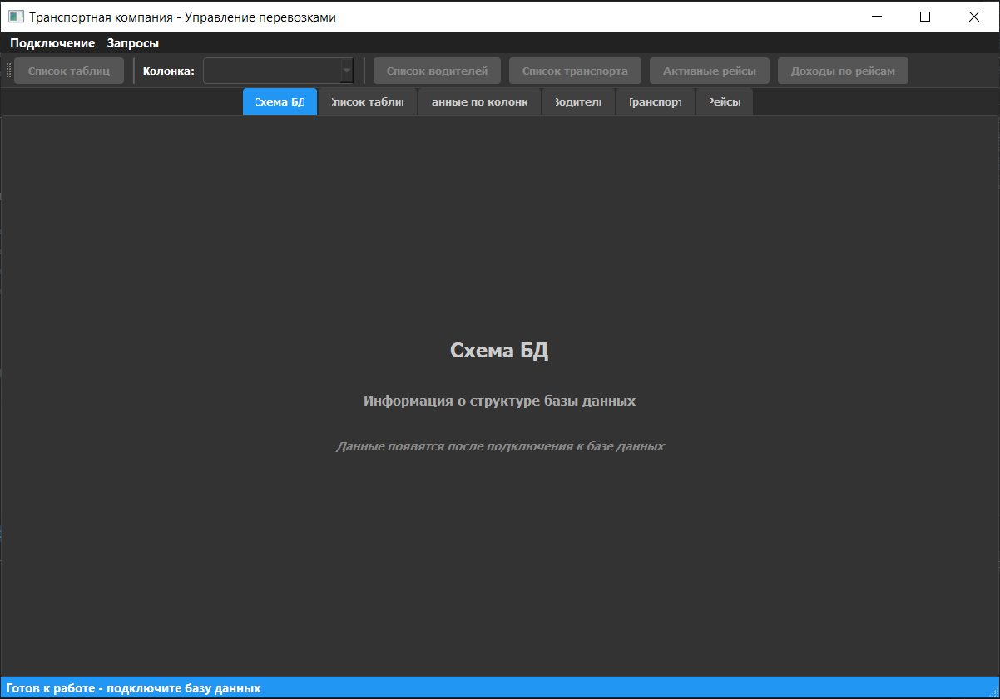

### Подключение и выбор БД
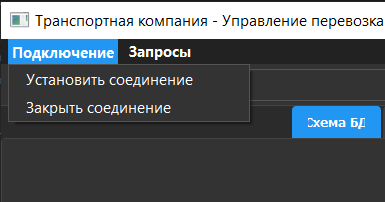

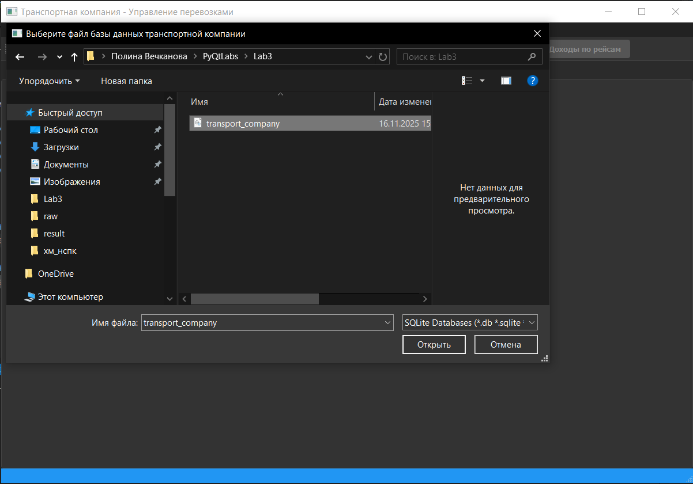

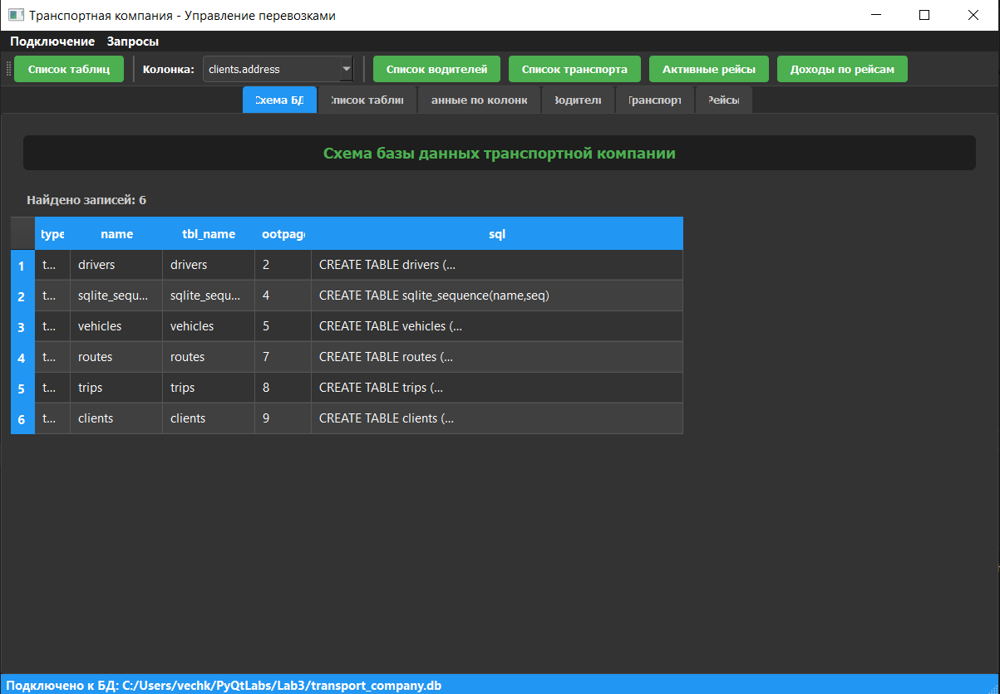

(по умолчанию открывается Схема БД)

### Нажатие на "Список таблиц"
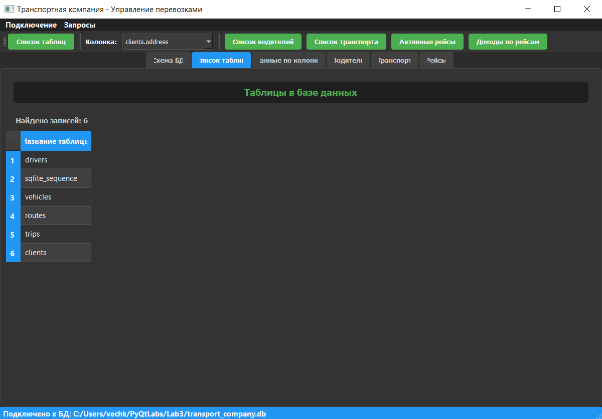

### Нажатие на "Список водителей"
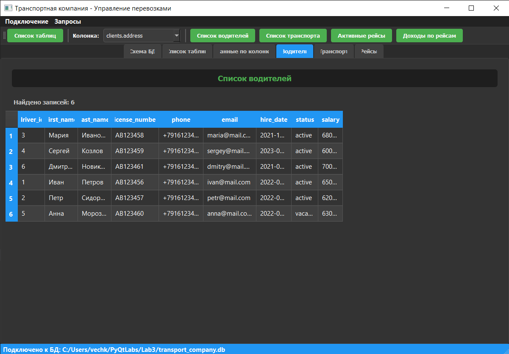

### Нажатие на "Список транспорта"
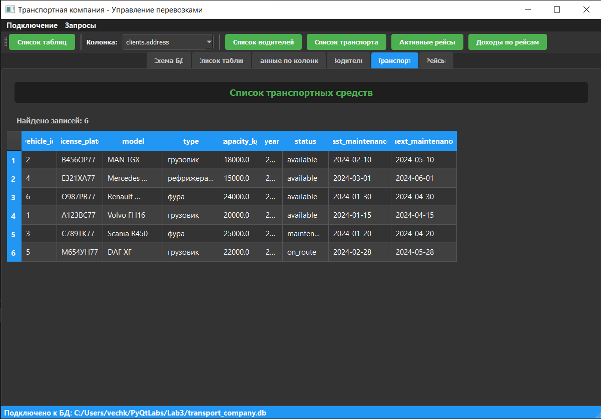

### Нажатие на "Активные рейсы"
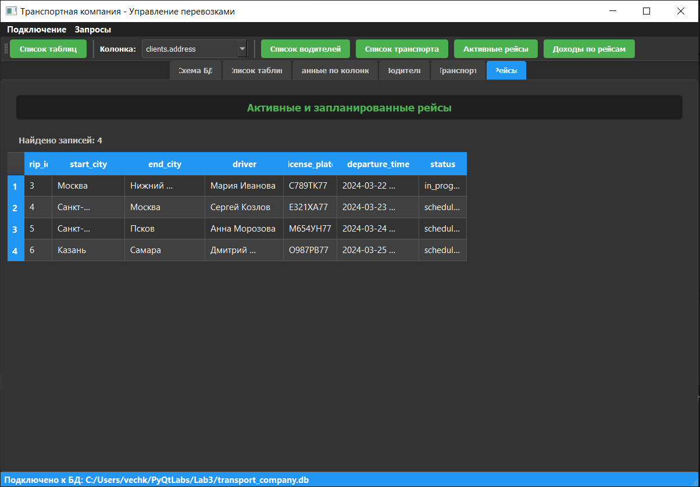

### Нажатие на "Доходы по рейсам"
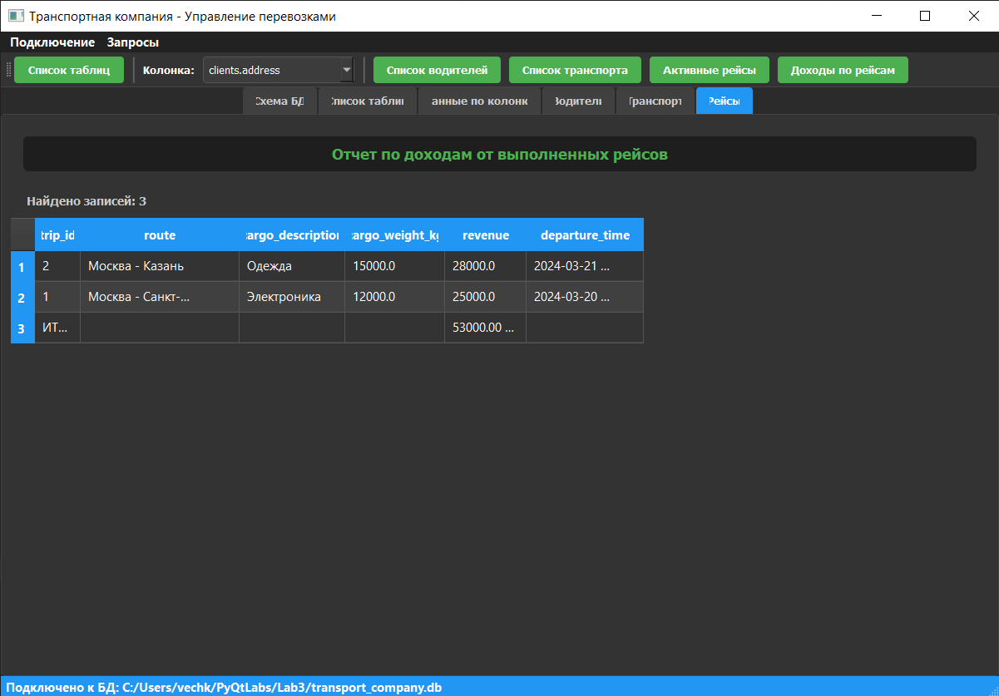

### Выбор колонки
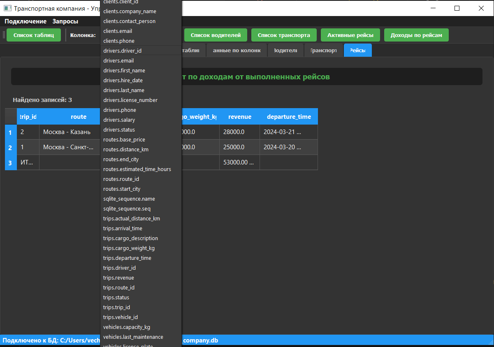

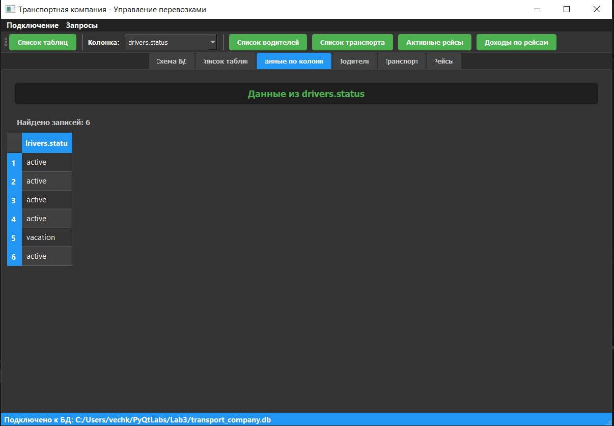

### Ввод собственного запроса
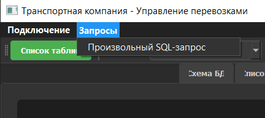

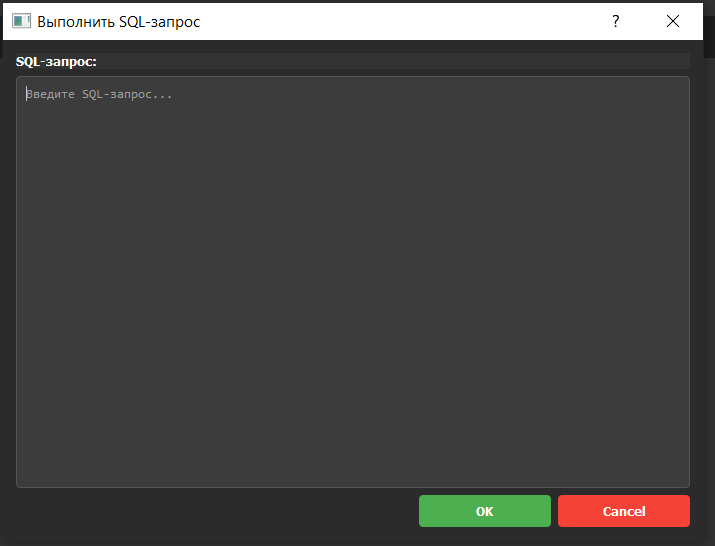

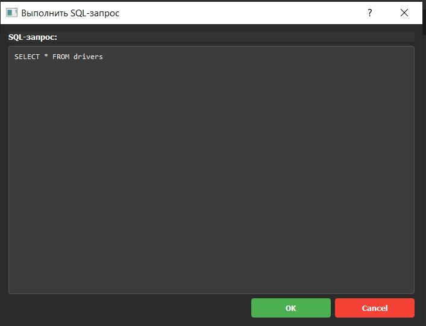

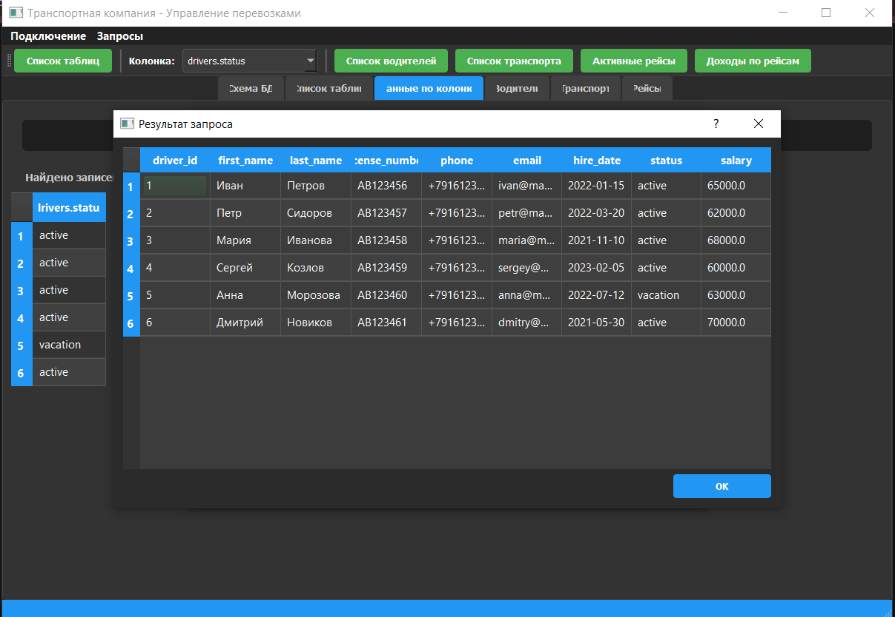