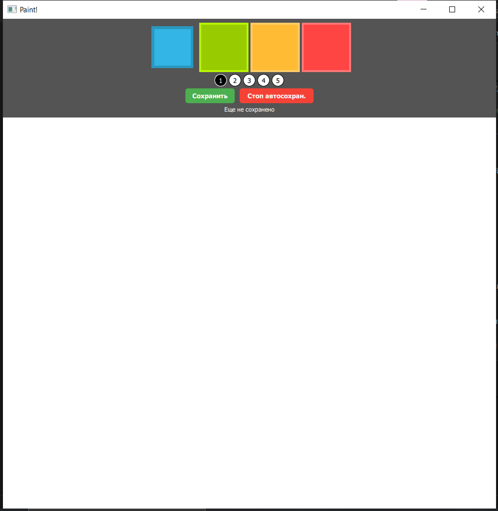
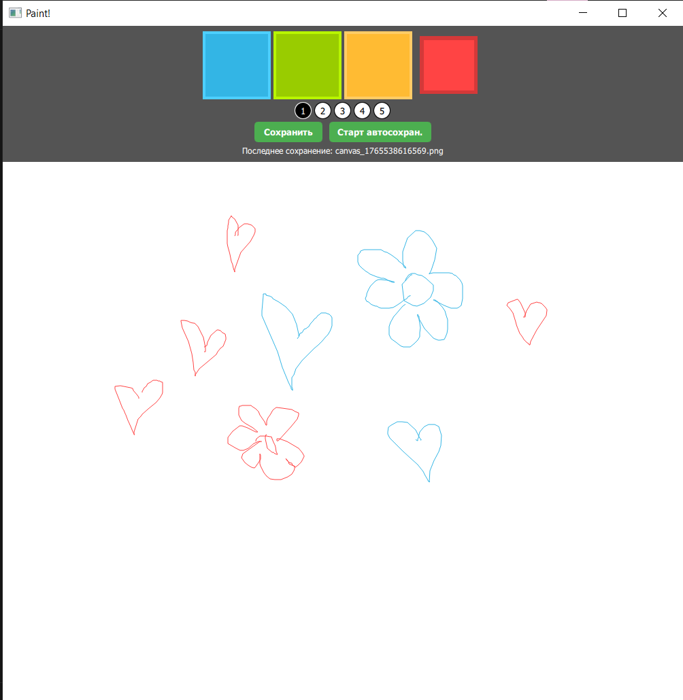
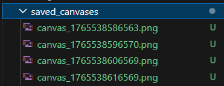
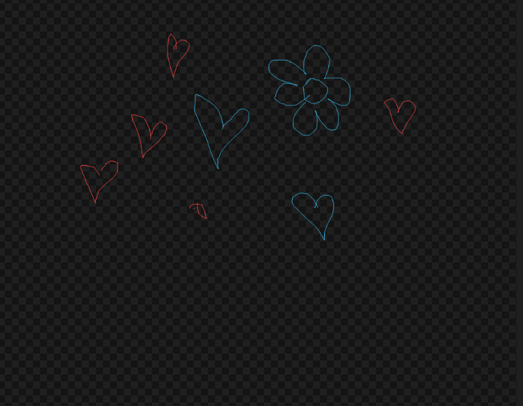

# Реализация автосохранения в Paint-приложении

## Задание
Реализация системы автосохранения области рисования `canvas` по таймеру на носитель информации в файл.

## Реализованная функциональность

### 1. Автосохранение через Python бэкенд
- Создан класс `Interface` в Python, управляющий таймером автосохранения
- Таймер `QTimer` настроен на интервал 10 секунд по умолчанию
- Автосохранение автоматически запускается при старте приложения

### 2. Система сохранения изображений
- Все сохраненные изображения помещаются в папку `saved_canvases`
- Файлы именуются по шаблону: `canvas_<timestamp>.png`

### 3. Управление автосохранением
- **Кнопка "Сохранить"**: ручное сохранение текущего состояния canvas
- **Кнопка "Старт/Стоп автосохран."**: управление автоматическим сохранением
- Статус автосохранения отображается в реальном времени

### 4. Архитектура
#### Backend (Python):
- Класс `Interface` с сигналами `saveRequested`, `saveTimerRunningChanged`, `saveIntervalChanged`
- Свойства с уведомлениями для синхронизации с QML
- Методы управления таймером: `startAutoSave()`, `stopAutoSave()`, `toggleAutoSave()`
- Метод `getSavePath()` для генерации путей сохранения

#### Frontend (QML):
- Интерфейс управления сохранением в панели инструментов
- Canvas с функцией `saveToFile()` для сохранения в PNG
- Обработчики сигналов от Python бэкенда
- Отображение информации о последнем сохранении

### Сигналы
- `saveRequested`: запрос на сохранение (используется таймером)
- `saveTimerRunningChanged`: изменение состояния таймера
- `saveIntervalChanged`: изменение интервала автосохранения

### Методы сохранения
1. **Автоматическое**: по таймеру каждые 10 секунд
2. **Ручное**: по нажатию кнопки "Сохранить"

## Используемые технологии
- **PyQt5**: для Python бэкенда
- **QtQuick/QML**: для графического интерфейса
- **QTimer**: для реализации автосохранения
- **Canvas API**: для рисования и сохранения изображений

## Примеры работы приложения
Запуск приложения - автоматическое начало автосохранения

Рисуем в окне

Проверяем автосохраненные файлы и изображение

